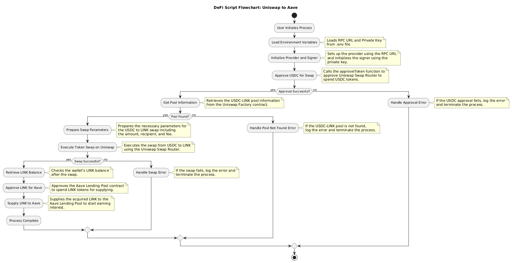

# DeFi Script: Uniswap and Aave Integration

## Overview of the Script

This script demonstrates a comprehensive integration between Uniswap V3 and Aave protocols on the Ethereum Sepolia testnet. The script allows users to swap USDC tokens for LINK tokens using Uniswap, and then supply the acquired LINK tokens to Aave to start earning interest. 

### Key Features:
1. **Token Swap on Uniswap**: The script initiates a swap of USDC for LINK using Uniswap V3's decentralized exchange. It interacts with various Uniswap smart contracts, including the Factory, Pool, and Swap Router.

2. **Approval Mechanism**: Before performing any token transactions (e.g., swap or supply), the script ensures that the required approvals are granted. It first approves Uniswap's Swap Router contract to spend USDC, and later approves Aave's Lending Pool contract to spend LINK.

3. **Liquidity Pool Interaction**: The script retrieves essential information about the USDC-LINK liquidity pool, such as the pool address, fee tier, and token pair details, to facilitate the swap.

4. **Token Supply on Aave**: After the LINK tokens are acquired through Uniswap, the script supplies these tokens to Aave's Lending Pool to earn interest, showcasing the composability of DeFi protocols.

### Work Summary:

1. **Initialize Environment**: The script begins by loading environment variables and initializing the Ethereum provider and signer with the user's private key.
   
2. **Approve USDC for Uniswap**: It approves the Uniswap Swap Router contract to spend the user's USDC tokens for the swap.
   
3. **Retrieve Pool Information**: The script retrieves the necessary information about the USDC-LINK pool from Uniswap's Factory contract.
   
4. **Execute Swap**: The script swaps USDC for LINK using Uniswap's Swap Router.

5. **Approve LINK for Aave**: It then approves the Aave Lending Pool contract to spend the acquired LINK tokens.

6. **Supply LINK to Aave**: Finally, the script supplies the LINK tokens to Aave's Lending Pool to start earning interest.

## Diagram Illustration

The diagram below illustrates the sequence of steps and interactions between the Uniswap and Aave protocols:

This flowchart provides a visual representation of the process, showing how the script interacts with different smart contracts on Uniswap and Aave, from initiating the token swap to supplying tokens to Aave.

